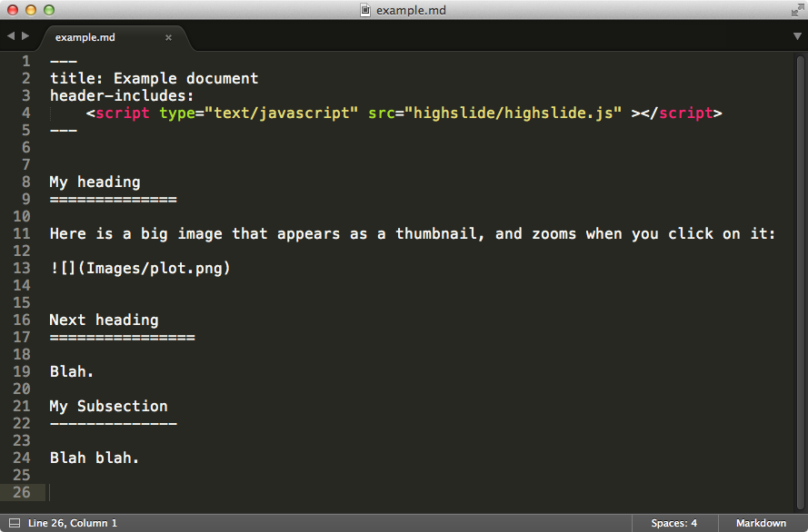
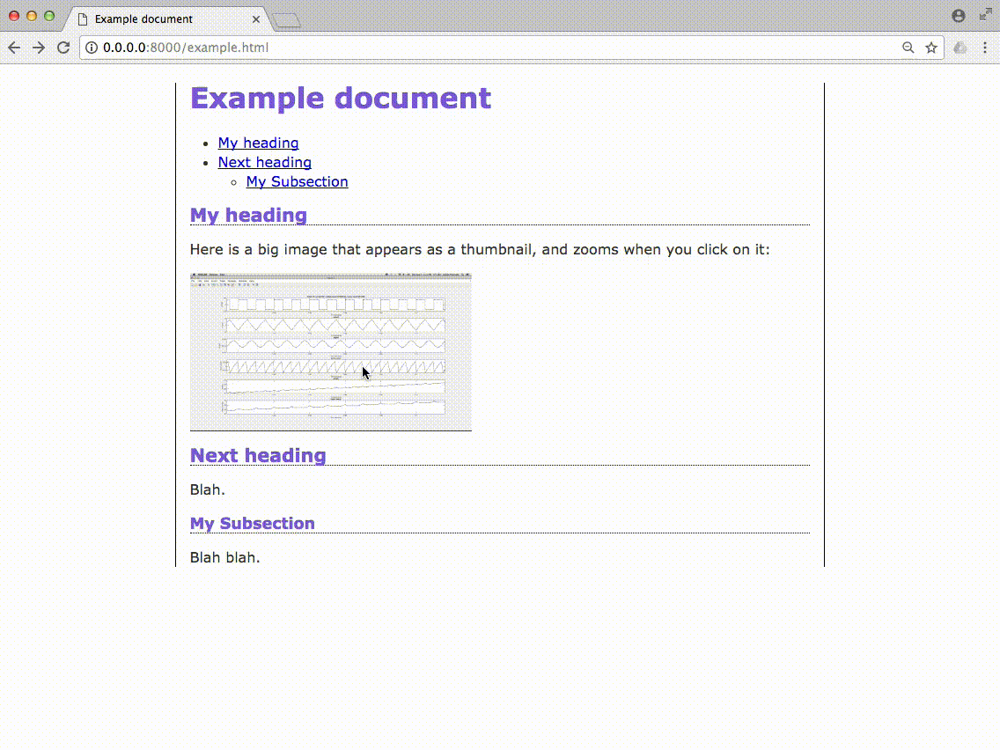

# Nice documentation with highslide and pandoc

An example of writing nice documentation in markdown, converting to HTML with pandoc, and using highslide Javascript for zoomable image thumbnails.

Example
----------

Start with this Markdown file `example.md`:

Run pandoc:

    pandoc -s --toc -f markdown -t html --filter img-to-zoomable-link.py -c pandoc.css -o example.html example.md

This creates `example.html` with nice CSS and zoomable images:

- (You may have to enable Javascript on your browser.)
- (In the Chrome browser, it is easiest to run a local webserver and allow Javascript on it: `$ python -m SimpleHTTPServer`)

Repo Contents
---------------

- Pandoc is a program for converting documents from one format to another.
    - `sudo apt-get install pandoc`
- `highslide.js` is a Javascript library for displaying images as thumbnails that zoom in when you click on them.
    - `http://highslide.com/download/highslide-5.0.0.zip`
- `pandoc.css` is a CSS file with some nice styling.
- `img-to-zoomable-link.py` is a pandoc filter that wraps each HTML image tag in a highslide Javascript function to display the image as a thumbnail.

Notes
------

- Each markdown file needs to start with a little YAML that instructs pandoc to include the highslide JS library:

    ---
    title: Example document
    header-includes:
        
    ---

- For PDF output, need "backslash space" after each img to put img placement precisely, like this:

    \ 

- Using Submline Text? Assign a keystroke to convert markdown to HTML:
    - Tools > Build System > New Build System...
    - Paste this text:

        {
            "shell_cmd": "pandoc -s --toc -f markdown -t html --filter img-to-zoomable-link.py -c pandoc.css -o \"$file_base_name.html\" \"$file_name\" " 
        }

    - Save as `my-markdown-to-html`, now it appears in `Tools` > `Build System`.
